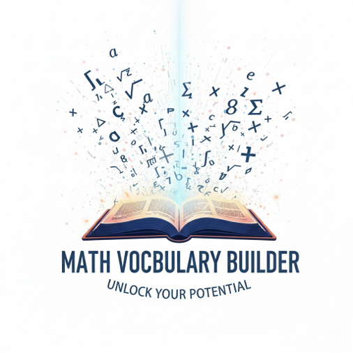

# Math Vocabulary Builder

## 📖 Description
**Math Vocabulary Builder** is a personal digital dictionary designed for students to master mathematical terminology. The app allows users to build and manage their own private collection of math terms, including names, definitions, examples, and categories.

I built this app to provide a centralized, private space for organizing complex math concepts. It ensures that each user has full control over their learning materials without interference from others.

## 🚀 Getting Started
* **Deployed App:** [View Deployed App](#)
* **Planning Materials:** [Trello Board](https://b24-u8s0h1.bitrix24.ae/~QKBCy)

## 🛠 Technologies Used
* **Backend:** Node.js, Express.js
* **Database:** MongoDB & Mongoose
* **Templating:** EJS (Embedded JavaScript)
* **Authentication:** Session-based authentication using `bcrypt`.
* **Math Rendering:** Integrated **MathJax** library for accessible and high-quality mathematical notation.
* **Styling:** Custom CSS with **Flexbox** and **Grid** for a responsive layout.
* **Icons:** Material Symbols & Emojis for better visual categorization.

## ✨ Key Features
* **Full CRUD Functionality:** Create, view, update, and delete your own math terms.
* **User Authorization:** Secure logic ensures that users can only manage the data they created.
* **Smart Categorization:** Terms are organized by math branches (Algebra, Geometry, etc.) with visual icons.
* **Immersive UI:** A dynamic mathematical themed background with CSS animations.
* **Accessibility:** All images include `alt` text, and color contrasts follow WCAG 2.0 standards.

## 🛣 Next Steps (Stretch Goals)
* **Search & Filter:** Add functionality to search terms by name or filter by category.
* **Flashcard Mode:** A study tool to hide definitions for self-testing.
* **Image Support:** Allow users to upload diagrams for geometric terms.

## Final Look

    

## ✍️ Attributions
* **Project Template:** Based on the **MEN-AUTH-TEMPLATE** by **Dujota** (SEB-11-BH), available at: [GitHub Repository](https://github.com/SEB-11-BH/MEN-AUTH-TEMPLATE).
* **Fonts:**  [Google Fonts](https://fonts.google.com).
* **MathJax:** For mathematical rendering support.
* **Google Material Symbols:** For the UI icons.

## 📝 Project Reflection

### 🧠 The Most Challenging Part
**Unified CSS Architecture:**
The most difficult part was creating a single, comprehensive CSS file that manages the entire application's styling. It was a challenge to ensure that the layout remained consistent and responsive across all views—from the dashboard to the edit forms—while maintaining a balanced and professional aesthetic throughout the project.

### 🌟 The Favorite Part
**Dynamic Animated Background:**
My favorite part was designing the mathematical-themed background. Using CSS keyframe animations to create floating math symbols added a unique, immersive feel to the app. It transformed a standard dictionary into a visually engaging environment that truly represents the subject of mathematics.

### ✅ The Easiest & Most Rewarding Part
**MathJax Integration:**
Integrating **MathJax** was surprisingly smooth and highly rewarding. It was the easiest way to elevate the project's quality, as it instantly converted plain text into beautiful, professional-grade mathematical equations. This feature ensured the dictionary looked like a real educational tool.

